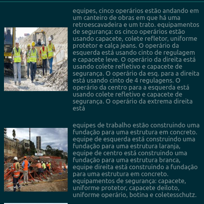

# Portuguese Paligemma
Use the Google VLM model to turn fine in Portuguese. 
Prepare the data getting public web images the people use personal protect equipment. And include the question to these images and the more complete answer.

After ajust the Paligemma to recognize the better way the Brazilian Portuguese Language. 

The result after 253 epochs was reduced lost and a understandable Portuguese text.

